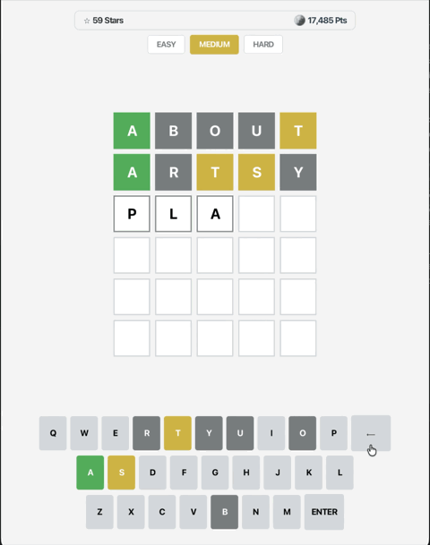

# Enhanced Wordle (JavaFX)

### An Extended Word-Guessing Game with New Features in Java & JavaFX
**Tech Stack:** Java 23 | JavaFX 21 | Apache Maven | MVC & Observer Patterns | OkHttp 4 | Datamuse REST API | Java Preferences API | Agentic AI

---

<p align="center">
  
</p>

---

## Overview

**Enhanced Wordle** is an expanded version of my desktop Wordle application built in Java and JavaFX. While preserving the core rules and MVC structure of the original game, this version adds several major features, including a persistent star and points scoring system, live vocabulary definitions, in-memory caching to eliminate redundant network requests, and custom victory animations.

The project maintains the **Model-View-Controller (MVC)** and **Observer** design patterns, ensuring that game state, background dictionary lookups, and JavaFX UI rendering remain cleanly separated.

---

## What’s New: Additions & Enhancements Over Original Wordle

| Feature Category | Original Wordle | Enhanced Wordle |
| :--- | :--- | :--- |
| **Scoring & Progression** | Round-by-round only; no score tracking | **Persistent 5-Star Rating & Points System** with difficulty multipliers and clean-play bonuses |
| **Data Persistence** | None (resets upon window close) | **Cross-Session Saves** via the Java Preferences API (`Preferences.userNodeForPackage`) |
| **Educational Features** | Shows the target word on round end | **Post-Game Word Showcase** with part of speech and dictionary definitions via Datamuse API |
| **Network & Performance** | Individual HTTP requests for each word selection and guess | **500-Word Batch Pre-fetching** + **Thread-Safe Guess Cache** (`ConcurrentHashMap`) |
| **Visual Feedback** | Basic shake animation on invalid input | **Staggered Tile Bounce** + **Confetti Particle Animation** on victory |
| **End-Game Screen** | Basic pop-up dialog | **Custom Modal Overlay** with SVG star ratings, itemized score receipts, and lifetime totals |
| **Player HUD** | Difficulty selector buttons only | **Header HUD Bar** displaying lifetime Stars (⭐) and Points (🪙) alongside difficulty controls |

---

### 1. Persistent Scoring & Star Rating System

- **Dynamic 5-Star Rating System**:
  - Stars are calculated based on difficulty mode and guess efficiency:
    - **Hard Mode**: Solved in $\le 3$ attempts = 5★, 4 attempts = 4★, 5 attempts = 3★ (clearing Hard Mode guarantees at least 3 stars).
    - **Medium Mode**: $\le 3$ attempts = 5★, 4 attempts = 4★, 5 attempts = 3★, 6 attempts = 2★.
    - **Easy Mode**: $\le 3$ attempts = 5★, 4 attempts = 4★, 5 attempts = 3★, 6 attempts = 2★, 7 attempts = 1★.
  - **Hint Penalty**: Using an in-game hint deducts 1 star (with a 1-star minimum on victory) to reward unassisted solves.
- **Points Model**:
  - **Base Win**: $+500$ points.
  - **Efficiency Bonus**: $+100$ points for each remaining unused attempt.
  - **Clean Play Bonus**: $+100$ points for solving the puzzle without hints.
  - **Difficulty Multipliers**: Final round points are scaled by **1.0x** (Easy), **1.2x** (Medium), and **1.5x** (Hard).
  - **Consolation Points**: On a loss, players receive $+25$ points per correctly placed green letter to reward partial progress.
- **Cross-Session Persistence**:
  - Total stars and points are saved across application launches using the native Java Preferences API.
- **Header HUD Bar**:
  - Displays lifetime Stars (⭐) and Points (🪙) directly above the game grid.

---

### 2. Live Word Definitions & Vocabulary Showcase

- **Asynchronous Definition Retrieval**:
  - Upon selecting a target word, the controller asynchronously queries the Datamuse API (`sp=<word>&md=d&max=1`) to fetch the definition and part of speech without blocking the UI.
- **Part-of-Speech Parser**:
  - Parses Datamuse definition codes and translates shorthand abbreviations (`n`, `v`, `adj`, `adv`) into readable labels (*noun*, *verb*, *adjective*, *adverb*).
- **Post-Game Word Card**:
  - The end-game screen includes an embedded card displaying the target word, an italicized part-of-speech badge, and its dictionary definition.

---

### 3. Caching & Network Optimization

- **500-Word Batch Pre-fetching**:
  - Instead of making separate HTTP calls each time a difficulty changes or a new round starts, the controller pre-fetches a pool of 500 5-letter words with frequency scores in a single request (`sp=?????&md=f&max=500`).
- **In-Memory Frequency Sorting**:
  - Word frequencies are parsed into a typed `WordFrequency` list and sorted using primitive comparisons (`Double.compare`), enabling fast local word selection across difficulty bands.
- **Fast-Path Validation & Thread-Safe Caching**:
  - Guesses that match the target word bypass network checks immediately.
  - Validated words are cached in a thread-safe `ConcurrentHashMap.newKeySet()`, ensuring repeated guesses resolve instantly without extra network latency.

---

### 4. UI Animations & Visual Feedback

- **Staggered Victory Tile Bounce**:
  - Winning row tiles play a sequenced `ScaleTransition` pop animation across each solved letter.
- **Confetti Particle Animation**:
  - Upon winning, a particle system spawns green, gold, and white confetti rectangles from each solved tile, animating trajectory drift, rotation, and fading.
- **End-Game Modal Overlay**:
  - Replaces standard alert dialogs with a styled dark overlay featuring status glows (green on victory, red on loss).
  - Displays an SVG star rating with drop-shadow effects.
  - Provides a score breakdown showing base points, remaining attempt bonuses, difficulty multipliers, and total round earnings.
  - Includes an animated button to start the next round.

---

## Architecture & Design Patterns

### Model-View-Controller (MVC)

- **Model (`com.wordle.model`)**:
  - `Model`: Core interface defining methods for game state, active guesses, grayed letters, difficulty settings, hint usage, stars/points scoring, and dictionary definition data.
  - `ModelImpl`: Handles game logic, including guess evaluation, letter matching, scoring math, star ratings, and saving progress via the Java Preferences API.
  - `Subject` & `Observer`: Implements the Observer pattern to decouple model state changes from view updates.

- **Controller (`com.wordle.controller`)**:
  - `Controller`: Interface defining user input handlers for keystrokes, difficulty changes, hints, and game restarts.
  - `ControllerImpl`: Coordinates user actions, manages the OkHttp client, handles the 500-word batch pre-fetch, queries word definitions asynchronously, and manages the in-memory guess cache.

- **View (`com.wordle.view`)**:
  - `AppLauncher`: JavaFX entry point that configures the application window, stage, and keyboard event listeners.
  - `View`: Master UI component managing the top HUD bar, letter grid, on-screen keyboard, tile animations, confetti effects, and end-game modal.
  - `FXComponent`: Functional interface defining renderable JavaFX UI components.

---

## Project Structure

```text
enhanced-wordle/
|-- pom.xml                                  # Maven dependencies & build configuration
`-- src/
    `-- main/
        |-- java/com/wordle/
        |   |-- Main.java                    # Application launch entry point
        |   |-- controller/
        |   |   |-- Controller.java          # Controller interface
        |   |   `-- ControllerImpl.java      # Async networking, caching & user input handling
        |   |-- model/
        |   |   |-- Model.java               # Core model interface (game state & scoring)
        |   |   |-- ModelImpl.java           # Game logic, scoring formulas, stars & persistence
        |   |   |-- Observer.java            # Observer notification interface
        |   |   `-- Subject.java             # Subject interface for event dispatch
        |   `-- view/
        |       |-- AppLauncher.java         # JavaFX application setup & window initialization
        |       |-- FXComponent.java         # Functional UI component interface
        |       `-- View.java                # Master view, animations & modal rendering
        `-- resources/
            `-- style/
                `-- wordle.css               # Base CSS stylesheet
```

---

## Getting Started

### Prerequisites

- **Java Development Kit (JDK)**: Version 21 or higher (JDK 23 recommended).
- **Apache Maven**: Version 3.8+ installed and available on `PATH`.
- **Internet Connection**: Required for Datamuse API word retrieval and definition queries.

### Running the Game

#### Option 1: Via Terminal (Maven)
Compile and launch the game directly from the project root:

```bash
mvn clean javafx:run
```

#### Option 2: Via IntelliJ IDEA
1. Open the project in IntelliJ IDEA.
2. Open the **Maven** tool window on the right sidebar.
3. Expand **Plugins** -> **javafx**.
4. Double-click **javafx:run**.

---

## How to Play

### Rules & Tile Feedback

The objective is to guess a hidden 5-letter English word within a limited number of attempts:
- Each guess must be a valid 5-letter word recognized by the dictionary.
- After submitting a guess, tiles provide immediate visual feedback:
  - 🟩 **Green**: Letter is correct and placed in the correct position.
  - 🟨 **Yellow**: Letter exists in the target word, but is in a different position.
  - ⬜ **Gray**: Letter is not in the target word.

### Controls

| Action | Physical Keyboard | On-Screen Keyboard |
| :--- | :---: | :---: |
| Enter Letter | `A`–`Z` | Click letter key |
| Delete Letter | `Backspace` | Click `⌫` key |
| Submit Guess | `Enter` | Click `ENTER` key |
| Request Hint | — | Click `REVEAL HINT` |
| Change Difficulty | — | Click `EASY`, `MEDIUM`, or `HARD` |

### Difficulty Tiers

| Setting | Max Attempts | Vocabulary Band | On-Screen Keyboard | Hints Available | Score Multiplier |
| :--- | :---: | :---: | :---: | :---: | :---: |
| **Easy** | 7 attempts | Common words (Top 20% frequency) | Enabled | Enabled | **1.0x** |
| **Medium** | 6 attempts | Moderate words (15%–35% frequency) | Enabled | Enabled | **1.2x** |
| **Hard** | 5 attempts | Rare / Challenging words (Bottom 20% frequency) | **Disabled** (Physical typing only) | **Disabled** | **1.5x** |

---

## Scoring & Rating System Reference

### Points Formula

$$\text{Round Score} = \Big(\text{Base Win (500)} + (\text{Remaining Attempts} \times 100) + \text{No-Hint Bonus (100)}\Big) \times \text{Difficulty Multiplier}$$

- **Consolation Points (Loss)**: $\text{Correctly Placed Green Letters} \times 25\text{ pts}$.

### Star Rating Criteria

- **5 Stars (★★★★★)**: Solved in 3 or fewer attempts without hints.
- **4 Stars (★★★★☆)**: Solved in 4 attempts.
- **3 Stars (★★★☆☆)**: Solved in 5 attempts (or clearing Hard Mode).
- **2 Stars (★★☆☆☆)**: Solved in 6 attempts (Medium / Easy).
- **1 Star (★☆☆☆☆)**: Solved on the final attempt (Easy).
- *Note: Using a hint deducts 1 star (minimum 1 star guaranteed on any victory).*
