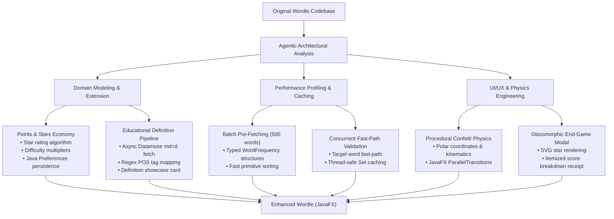

# Enhanced Wordle (JavaFX)

### An Advanced Desktop Word-Guessing Game & Vocabulary Engine in Java & JavaFX
**Tech Stack:** Java 23 | JavaFX 21 | Apache Maven | MVC & Observer Architecture | OkHttp 4 | Datamuse REST API | Java Preferences API

---

## Overview

**Enhanced Wordle** is an upgraded, production-grade desktop word-guessing game and vocabulary-building engine built with Java and JavaFX. While retaining the beloved core mechanics of the classic Wordle game, this project significantly evolves the application architecture, user experience, visual presentation, and performance.

The project strictly follows the **Model-View-Controller (MVC)** and **Observer** design patterns, maintaining strict decoupling between game logic, asynchronous dictionary networking, and reactive JavaFX rendering. 

Building upon the original Wordle base, Enhanced Wordle introduces a **persistent gamification economy** (points, stars, and difficulty multipliers), an **educational vocabulary integration** (real-time definition and part-of-speech retrieval), a **high-performance batch caching network architecture**, and **smooth visual animations** (including procedural particle confetti and a glassmorphic end-game modal).

---

## What’s New: Additions & Enhancements Over Original Wordle

| Feature Category | Original Wordle | Enhanced Wordle |
| :--- | :--- | :--- |
| **Economy & Gamification** | Round-by-round only; no scoring or star system | **Persistent 5-Star Rating & Points Economy** with difficulty multipliers and clean-play bonuses |
| **Progress Persistence** | None (resets upon window close) | **Session-to-Session Persistence** via Java Preferences API (`Preferences.userNodeForPackage`) |
| **Educational Value** | Simple word reveal on round end | **Real-Time Word Showcase** with part of speech and dictionary definition via Datamuse API |
| **Network & Performance** | Repeated individual network requests for each word and guess | **High-Throughput Batch Pre-fetching (500 words)** + **Thread-Safe Guess Cache** (`ConcurrentHashMap`) |
| **Visual Animations** | Standard shake animation | **Bouncy Victory Tile Scaling** + **Procedural Particle Confetti Engine** |
| **End-Game Screen** | Basic dialogue text alert | **Glassmorphic Modal Overlay** with SVG star ratings, itemized score receipt, and bank summaries |
| **Player HUD** | Minimal difficulty selector | **Top HUD Bar** displaying lifetime Stars and Points alongside difficulty controls |

---

### 1. Persistent Gamification & Star Economy

- **Dynamic 5-Star Rating System**:
  - Stars are calculated based on difficulty mode and guess efficiency:
    - **Hard Mode**: Solved in $\le 3$ attempts = 5★, 4 attempts = 4★, 5 attempts = 3★ (clearing Hard Mode guarantees a minimum of 3 stars).
    - **Medium Mode**: $\le 3$ attempts = 5★, 4 attempts = 4★, 5 attempts = 3★, 6 attempts = 2★.
    - **Easy Mode**: $\le 3$ attempts = 5★, 4 attempts = 4★, 5 attempts = 3★, 6 attempts = 2★, 7 attempts = 1★.
  - **Hint Trade-Off Penalty**: Using an in-game hint incurs a 1-star penalty (with a 1-star floor on victory) to reward unassisted solves.
- **Comprehensive Points Scoring Model**:
  - **Base Win**: $+500$ points.
  - **Efficiency Bonus**: $+100$ points for each remaining unused attempt.
  - **Clean Play Bonus**: $+100$ points for clearing the puzzle without hints.
  - **Difficulty Multipliers**: Final round points are scaled by **1.0x** (Easy), **1.2x** (Medium), and **1.5x** (Hard).
  - **Consolation Reward**: On a loss, players receive $+25$ points per correctly identified green letter to encourage continued play.
- **Cross-Session Persistence**:
  - Total stars and points persist across application launches using the native Java Preferences API.
- **Interactive Top HUD**:
  - An integrated header displays lifetime Stars (⭐) and Points (🪙) above the game grid.

---

### 2. Educational Integration & Word Definition Showcase

- **Live Dictionary Definition Retrieval**:
  - Upon selecting a target word, the controller asynchronously queries the Datamuse API (`sp=<word>&md=d&max=1`) to retrieve the word's definition and grammatical role.
- **Part-of-Speech Parser**:
  - Parses raw Datamuse definitions and automatically maps abbreviations (`n`, `v`, `adj`, `adv`) into human-readable labels (*noun*, *verb*, *adjective*, *adverb*).
- **Post-Game Vocabulary Showcase**:
  - The victory and defeat modal features an embedded word card displaying the target word, an italicized part-of-speech badge, and the complete dictionary definition.

---

### 3. High-Performance Caching & Network Optimization

- **500-Word Batch Pre-fetching**:
  - Rather than making individual HTTP network calls every time a mode changes or a new round starts, the controller pre-fetches a candidate pool of 500 5-letter words with frequency scores (`sp=?????&md=f&max=500`).
- **Single-Pass In-Memory Indexing**:
  - Frequencies are parsed once into a strongly-typed `WordFrequency` list and sorted via primitive comparisons (`Double.compare`), enabling instantaneous $O(1)$ word selection for all difficulty bands.
- **Multi-Tier Guess Fast-Path & Concurrent Caching**:
  - Guesses matching the target word bypass network validation immediately.
  - Validated words are memoized in a thread-safe `ConcurrentHashMap.newKeySet()`. Repeated words or subsequent rounds with common words execute with zero network latency.

---

### 4. Next-Level UI/UX Polish & Animation Physics

- **Staggered Victory Tile Bounce**:
  - Winning row tiles execute a sequenced `ScaleTransition` (1.26x scale expansion with `Interpolator.EASE_OUT`) creating a celebratory wave across the solved letters.
- **Procedural Particle Confetti Engine**:
  - When a round is won, a custom particle system spawns multi-colored green, gold, and white confetti rectangles from each winning letter tile.
  - Particles simulate physics with randomized polar angles, velocities, gravity trajectories, rotational spin, and gradual opacity fade-outs.
- **Modern Glassmorphic End-Game Modal**:
  - Replaces basic dialogs with an animated dark overlay (`linear-gradient(to bottom, #23272e, #16191e)`) featuring ambient status glows (emerald green on victory, crimson on game over).
  - Scaled SVG star ratings with radiant glow drop-shadows.
  - Detailed itemized receipt breakdown displaying base score, remaining attempt bonuses, difficulty multipliers, and total round earnings.
  - Animated primary Call-to-Action button with gradient styling and hover micro-interactions.

---

## How Agentic AI Was Utilized

This project leveraged **Agentic AI** as an autonomous engineering partner throughout the entire development lifecycle—from conceptualization and architectural design to optimization and implementation.



### 1. Architectural Synthesis & Non-Breaking Refactoring
- **Preserving MVC Integrity**: The agent analyzed the existing codebase and designed extensions for scoring, star progression, and dictionary lookups that strictly preserved the decoupling of the **MVC** and **Observer** patterns.
- **Contract Expansion**: The `Model` and `ModelImpl` contracts were cleanly extended with dedicated getters and state mutators without introducing breaking changes to existing observer subscribers.

### 2. Autonomous Performance Profiling & Network Architecture
- **Bottleneck Detection**: Agentic analysis pinpointed excessive network latency caused by individual HTTP calls per word selection and guess submission.
- **Caching Pipeline**: The agent architected an in-memory batch pre-fetcher for 500 words, designed a typed `WordFrequency` container with primitive sorting, and integrated a `ConcurrentHashMap` set for non-blocking guess validation caching.

### 3. Game Economy & Mathematical Balancing
- **Formula Design**: The agent formulated balanced scoring equations combining base points, attempt bonuses, clean-play incentives, and difficulty multipliers ($1.0\times$ to $1.5\times$).
- **Fair Star Curves**: Developed non-linear star allocation thresholds tailored specifically to the attempt caps of each difficulty tier, factoring in hint penalties while safeguarding a minimum reward for victory.

### 4. JavaFX Physics & UI/UX Engineering
- **Kinematic Particle Simulation**: The agent mathematically formulated and implemented the confetti particle system, calculating polar angle trajectories, gravitational drift, rotation deltas, and fade interpolations using native JavaFX animation timelines (`TranslateTransition`, `RotateTransition`, `FadeTransition`, `ParallelTransition`).
- **Modern UI Styling**: Formulated dark-mode CSS styling, dynamic SVG star paths, and glassmorphic card overlays with responsive layouts and ambient glow effects.

---

## Architecture & Design Patterns

### Model-View-Controller (MVC)

- **Model (`com.wordle.model`)**:
  - [`Model`](file:///Users/kumaresan/IdeaProjects/enhanced-wordle/src/main/java/com/wordle/model/Model.java): Complete contract exposing game lifecycle, guesses, grayed letters, difficulty modes, hint states, points/stars economy, and word definition data.
  - [`ModelImpl`](file:///Users/kumaresan/IdeaProjects/enhanced-wordle/src/main/java/com/wordle/model/ModelImpl.java): Core business logic handling attempt evaluation, letter matching, scoring formulas, star ratings, and local state persistence via the Java Preferences API.
  - [`Subject`](file:///Users/kumaresan/IdeaProjects/enhanced-wordle/src/main/java/com/wordle/model/Subject.java) & [`Observer`](file:///Users/kumaresan/IdeaProjects/enhanced-wordle/src/main/java/com/wordle/model/Observer.java): Observer pattern implementation decoupling state mutations from view updates.

- **Controller (`com.wordle.controller`)**:
  - [`Controller`](file:///Users/kumaresan/IdeaProjects/enhanced-wordle/src/main/java/com/wordle/controller/Controller.java): Input management interface handling keystrokes, difficulty shifts, and game restarts.
  - [`ControllerImpl`](file:///Users/kumaresan/IdeaProjects/enhanced-wordle/src/main/java/com/wordle/controller/ControllerImpl.java): Coordinates user input, manages the OkHttp client, executes the 500-word batch pre-fetch, queries word definitions asynchronously, and maintains the concurrent guess validation cache.

- **View (`com.wordle.view`)**:
  - [`AppLauncher`](file:///Users/kumaresan/IdeaProjects/enhanced-wordle/src/main/java/com/wordle/view/AppLauncher.java): Application bootstrapper initializing MVC components, scene hierarchy, and keyboard event handlers.
  - [`View`](file:///Users/kumaresan/IdeaProjects/enhanced-wordle/src/main/java/com/wordle/view/View.java): Master reactive UI component managing the top HUD bar, grid layout, virtual keyboard, staggered tile bounce, procedural confetti engine, and glassmorphic end-game modal.
  - [`FXComponent`](file:///Users/kumaresan/IdeaProjects/enhanced-wordle/src/main/java/com/wordle/view/FXComponent.java): Functional interface defining renderable JavaFX UI nodes.

---

## Project Structure

```text
enhanced-wordle/
|-- pom.xml                                  # Maven dependencies & build configuration
|-- src/
|   |-- main/
|   |   |-- java/com/wordle/
|   |   |   |-- Main.java                    # Application launch entry point
|   |   |   |-- controller/
|   |   |   |   |-- Controller.java          # Controller contract
|   |   |   |   `-- ControllerImpl.java      # Async networking, caching & input handling
|   |   |   |-- model/
|   |   |   |   |-- Model.java               # Core model interface (game & economy state)
|   |   |   |   |-- ModelImpl.java           # Game logic, scoring, stars & persistence
|   |   |   |   |-- Observer.java            # Observer notification interface
|   |   |   |   `-- Subject.java             # Subject interface for event dispatch
|   |   |   `-- view/
|   |   |       |-- AppLauncher.java         # JavaFX application stage setup
|   |   |       |-- FXComponent.java         # Functional UI component interface
|   |   |       `-- View.java                # Master view, animations & glassmorphic modal
|   |   `-- resources/
|   |       `-- style/
|   |           `-- wordle.css               # Base CSS stylesheet
```

---

## Getting Started

### Prerequisites

- **Java Development Kit (JDK)**: Version 21 or higher (JDK 23 recommended).
- **Apache Maven**: Version 3.8+ installed and available on `PATH`.
- **Internet Connection**: Required for initial Datamuse API word retrieval and definition queries.

### Build and Run Directly

Compile and execute the application using the JavaFX Maven plugin:

```bash
mvn clean javafx:run
```

### Packaging an Executable JAR

Build a standalone executable JAR bundling all required dependencies:

```bash
mvn clean package
```

Run the compiled JAR:

```bash
java -jar target/enhanced.wordle-1.0-SNAPSHOT.jar
```

---

## How to Play

### Rules & Tile Feedback

The objective is to guess a hidden 5-letter English word within a limited number of attempts:
- Each guess must be a valid 5-letter word recognized by the dictionary.
- After submitting a guess, tiles provide immediate visual feedback:
  - 🟩 **Green**: Letter is correct and placed in the exact position.
  - 🟨 **Yellow**: Letter exists in the target word, but is in a different position.
  - ⬜ **Gray**: Letter is not in the target word.

### Controls

| Action | Physical Keyboard | On-Screen Keyboard |
| :--- | :---: | :---: |
| Enter Letter | `A`–`Z` | Click letter button |
| Delete Letter | `Backspace` | Click `⟵` key |
| Submit Guess | `Enter` | Click `ENTER` key |
| Request Hint | — | Click `REVEAL HINT` |
| Change Difficulty | — | Click `EASY`, `MEDIUM`, or `HARD` |

### Difficulty Tiers

| Setting | Max Attempts | Vocabulary Band | On-Screen Keyboard | Hints Available | Score Multiplier |
| :--- | :---: | :---: | :---: | :---: | :---: |
| **Easy** | 7 attempts | Common words (Top 20% frequency) | Enabled | Enabled | **1.0x** |
| **Medium** | 6 attempts | Moderate words (15%–35% frequency) | Enabled | Enabled | **1.2x** |
| **Hard** | 5 attempts | Rare / Obscure (Bottom 20% frequency) | **Disabled** (Physical typing only) | **Disabled** | **1.5x** |

---

## Scoring & Rating System Reference

### Points Formula

$$\text{Round Score} = \Big(\text{Base Win (500)} + (\text{Remaining Attempts} \times 100) + \text{No-Hint Bonus (100)}\Big) \times \text{Difficulty Multiplier}$$

- **Defeat Consolation**: $\text{Correctly Placed Green Letters} \times 25\text{ pts}$.

### Star Rating Criteria

- **5 Stars (★★★★★)**: Solved in 3 or fewer attempts without hints.
- **4 Stars (★★★★☆)**: Solved in 4 attempts.
- **3 Stars (★★★☆☆)**: Solved in 5 attempts (or clearing Hard Mode).
- **2 Stars (★★☆☆☆)**: Solved in 6 attempts (Medium / Easy).
- **1 Star (★☆☆☆☆)**: Solved on the final attempt (Easy).
- *Note: Using a hint deducts 1 star (minimum 1 star guaranteed on any victory).*
